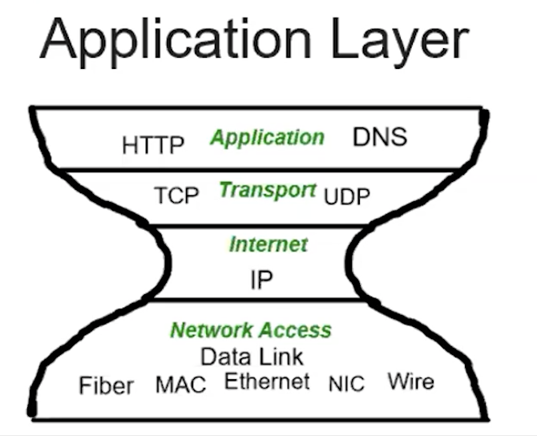
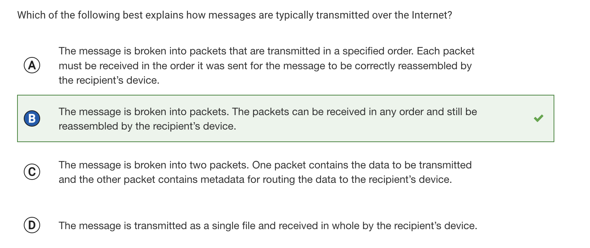
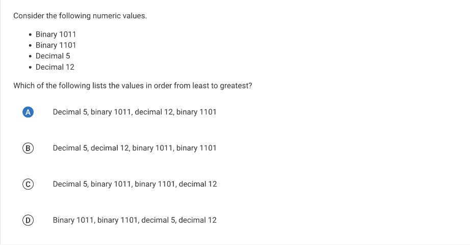
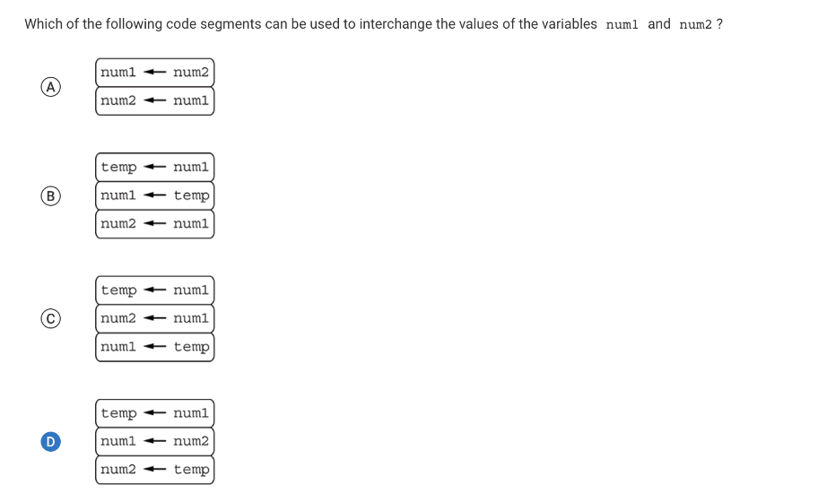
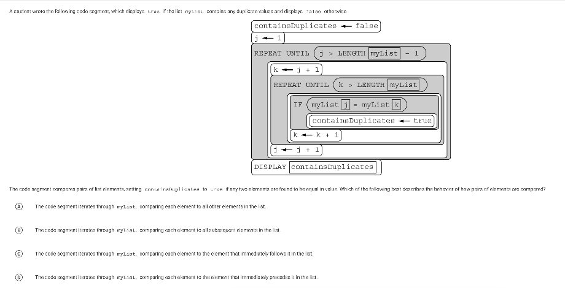
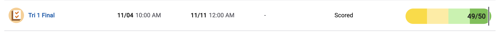

# Notes

## 1.1
<mark>Collboration<mark>
- Effective collaboration produces a computing innovation that reflects the diversity of talents and perspectives of those who designed it
- A computing innovation includes a program as an integral part of its function
- A computing innovation can be physical (eg. self-driving car), nonphysical computing software (eg. picture editing software), or a nonphysical computing concept (eg. e-commerce)
- Collaboration that includes diverse perspectives helps avoid bias in development

How to collaborate in class?
- Two programmers work together as a pair. One (the driver) writes program code, while the other (the observer, pointer, or navigator) reviews each line of program code as it is typed in
- Don't be a back-seated programmer!
- Think-Pair-Share: Students think through a problem alone, pair with a partner to share ideas, and then share results with the class
- Leave comments in code
  - Communicate to your partner(s)
  - Communicate to yourself
  - Acknowledge code segments used from other sources
  - Acknowledge media used form other sources
  - Differentiate what you and your partner(s) did
  - Clarify the functionality of yoru code
- Online tools:
  - repl.it - multiplayer
  - Github - collaboration and repository
  - Share document or folder
  - Ask friends and family to test your program and give you feedback
  - Check with your teacher

## 1.2
 <mark>Computing Innovations</mark>
- Applications
  - Games
  - Social Media
  - Business
  - Productivity
- Physical Devices
  - Computers
  - Smart Phones/tablets
  - Smart "Things"
  - Wearables
- Systems
  - E-commerce
  - Cloud services
  - E-mail

<mark>Inputs and Outputs</mark>
- Input can come from a user or other programs
  - Tactile (touch)
  - Audio
  - Visual
  - Text (including numerical values)
- How do programs receive input?
  - Most programs are written in an event driven environment
    - Events are triggered by some action, which usually sends input to the program
- What does input accomplish in a program?
  - Input usually affects the output
- What are outputs produced by a device?
  - Visual
  - Audio
  - Tactile (touch/feel)
  - Text
- How does a program know what to do upon an event?
  - An action triggers an event
    - Action may be initiated by the user or another program/device
- The program code is not necessarily executed "in order"
  - Code segments are executed as they are called, according to the events triggered

<mark>What is a program</mark>
- A program is a collection of statements
    - A statement is a single command
    - A group of statements is called a code segment
    - Code segments are executed according to the rules of the programming language

## 1.3
<mark>How is a program developed?</mark>
- It starts with an idea
  - Programs are developed with a specific purpose in mind
  - Developers follow specific steps and stick to their plan
  - Sometimes the development is more exploratory than anything, and the steps are dictated by what happens (both good and bad)
- Developers start investigating the problem/purpose and reflect
  - Investigation is an important step in the process
  - Developers must:
    - Determine the requirements of the program
    - Understand the constraints
  - How do developers investigate?
    - Surveys
    - User testing
    - Interviews
    - Direct observations
- Design the program
- Testing, testing, and more testing!

<mark>How is a program developed</mark>
- Program development is rarely a solo endeavor
  - Programs are usually developed by teams of people
  - Individuals/teams work on different functional components
  - Each member of the project deserves to receive credit for their work
  - Their names must be written in the documentation of the program indicating their contributions to the project
- Can use comments within the programming language to give credit
- Many times developers use code segments, procedures, algorithms, and more that are written by others
  - Need to give credit
  - The program documentation should include the author's name and the source of any code segments being used
  - May resemble a bibliography or works cited page
<mark>Program documentation</mark>
- Describes the overall program
- List program specifications
- Where does documentation happen
  - Happens throughout the development of the program
    - At the beginning: list specifications
    - During: to keep track of process
    - After: to explain the overall process

## 1.4
<mark>Errors in an algorithm program</mark>

  
## 4.1
<mark>How do computing devices work together in a network?</mark>
- Computers were once big. They grew smaller and smaller as time evolved. 
- Computers (their users) wanted to talk
  - Computers are capable of sending and receiving data
    - A packet is a small amount of data sent over a network. Each packet also includes the source and the destination information
- So how do we get computer to connect and communicate?
  - A computer network is a group of interconnected computing devices capable of sending or receiving data
  - A computer system is a group of computing devices and programs working together for a joint purpose
- A bandwidth is the maximum amount of data that can be sent in a fixed amount of time on a computer network

## 4.2

## 2.1
<mark>Binary Numbers</mark>
- Binary is a number system that uses two digits
  - 1 is on
  - 0 is off
- Binary digit (bit) is the smallest unit of data in computing
- Byte is a group of 8 bits
- Analog: a mechanism, device, or technology that represents data by measurement of a continuous physical variable
- The use of digital data to approximate real world analog data is an example of abstraction
# Final MC
Even though I didn't make too many mistakes on the test, I had a few uncertain questions that I would like to delve deeper into. The first topic that I wasn't too clear about is the internet. 

From this question, I concluded that I really just needed to memorize that information, even though it is not particularly useful for the CSP class. 

The next topic that I needed to focus on is binary. Previous to the final exam, I only had a brief idea of what binary is and mainly guessed the answers for the test. After the test, I located the binary video from collegeboard, and took notes on it, now I am a lot clear on binary questions. 

Before solving this problem, I mainly just guessed, but after watching the collegeboard videos I now understand how to do this question. Binary 0011 is equivalent to 2^1+2^0, or decimal 3. Binary 0110 is equivalent to 2^2+2^1, or decimal 6. Binary 1111 is equivalent to 2^3+2^2+2^1+2^0, or decimal 15. Decimal 9 is not equivalent to any of the given binary numbers.

Another type of problem that I struggled with is value swapping. 

The important thing about value swapping is setting a temporary variable for what you want to swap. For example, if you want to swap num1 and num2, you would assign a temp value to num1 first, then assign the value of num2 to num1, and then lastly assign the original value of num1, which is stored in temp, to num2. The original values of num1 to num2 are now interchanged

Something else that I had issues with is the vocabulary.

I had difficulty distinguishing between "all other", "subsequent", "immediately follows", and "immediately precedes". I guessed that the choice is "subsequent" because immediately follows and immediately precedes is similar in definition, and the answer is definitely not all other, so I chose the last option left.Later on, I went back to the problem to find an explanation why the correct choice is "subsequent", and that is because the outer loop iterates from the first element in the list to the second-to-last element in the list. For each iteration of the outer loop, the inner loop compares that element to every subsequent element in the array. 

