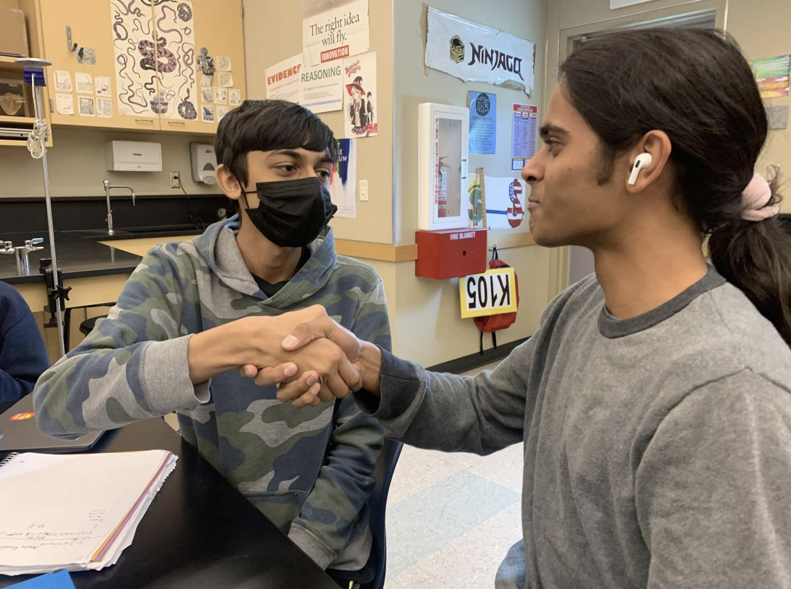

## Project 1

This project from the CSA class was beautifully designed. The color scheme and font matches together really well, and it gave me a very pleasant experience navigating through their website. From this project I learned how important the UI of a website is, and how I can take advantage of this to make my own website more enjoyable. 

## Project 2

This project really surprised me because they used Google Maps as the core part of their project. Me and my group actually brainstormed about a website based off an interactive map, but we scrapped the idea because we thought it would be too hard to successfully execute. Looking at this project, the "Near Me Finder" is perfectly executed by using an already mature resource that is Google Maps

## Project 3

This is another part of the previous group's project. I feel like this project is very unique and very well put together. As the website is titled "Rental Retreats", I believed the features of a schedule maker, reviews page, near me finder, and pick your homes ties to the central theme extremely well. 

## Project 4

This person's N@M project perfectly embodies how me and many students feel about the various AP course offerings of Del Norte High. This perfectly embodied how I felt when I took the AP Physics C Mechanics work and energy unit test. 

## Project 5

On the surface, this is just two men shaking hands, but this image actually has significant political importance. The young man on the left, is of Pakistani origin, and the young man on the right, is of Indian origin. In this day of age, India and Pakistan has not had the brightest of political relations. However, in this picture, what's supposed to be enemies, are actually shaking hands. Government doesn't define how people feel, and this is the perfect embodiment.

## Reflection
This tri's N@M projects were a lot better than last tri's because everyone seemed to be polishing their skills as the year goes on. All of the projects that I have looked at inspired me for my own project, so I believe this N@M was definitely not a waste of time, but rather a very fruitful experience. 